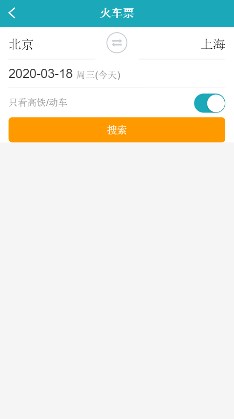
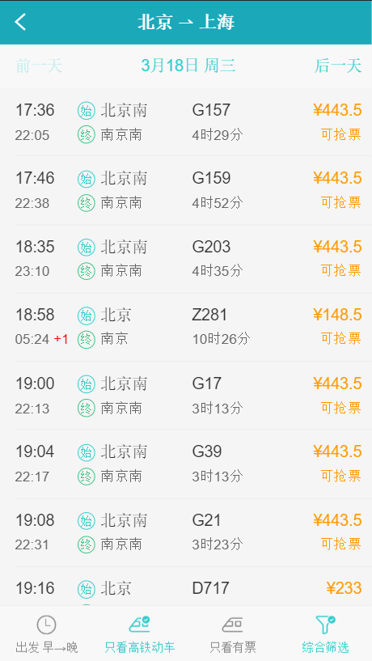
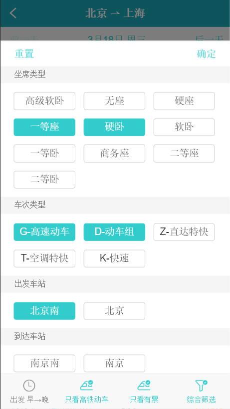
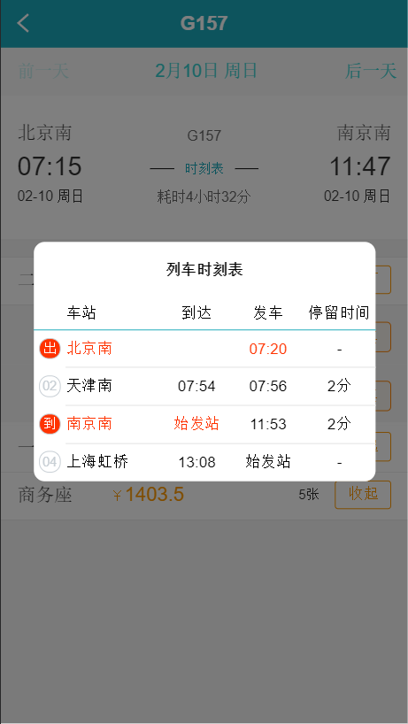
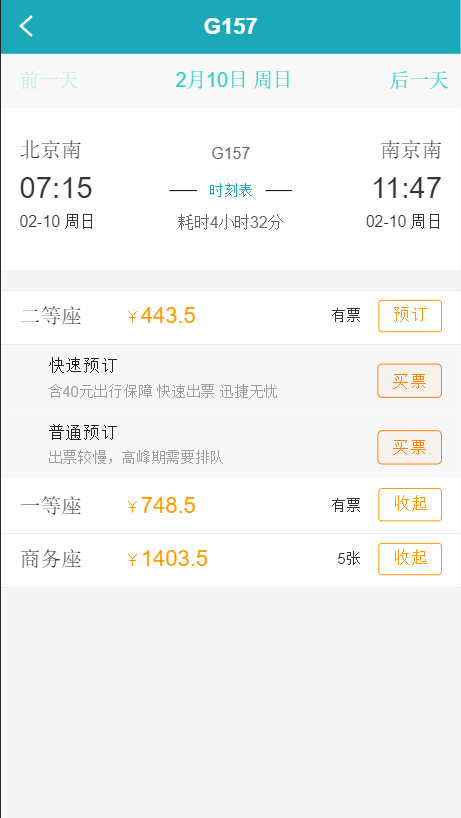
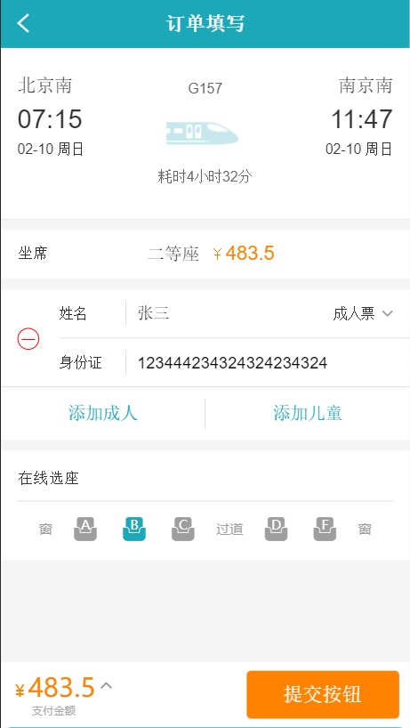
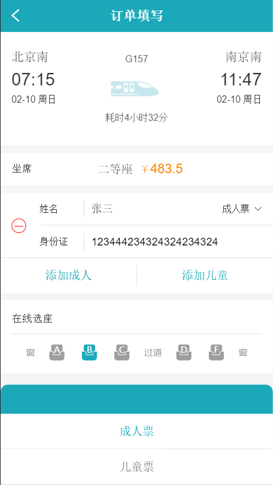
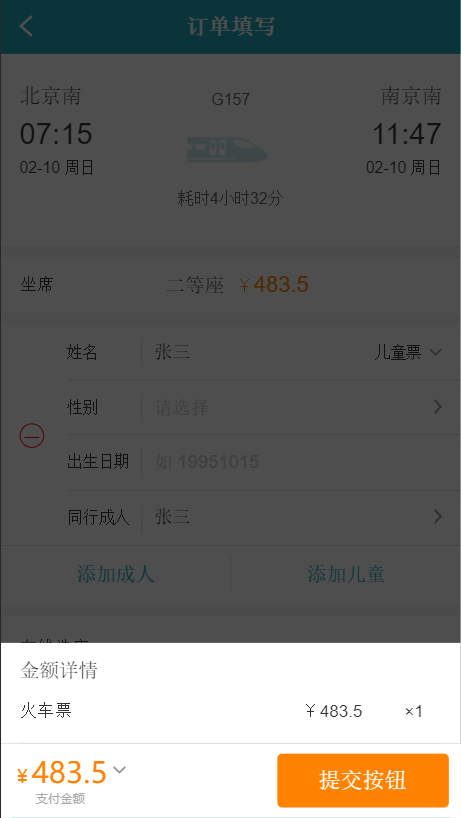

<!--
 * @Descripttion: 
 * @Author: jiegiser
 * @Date: 2020-03-09 08:25:23
 * @LastEditors: jiegiser
 * @LastEditTime: 2020-03-18 09:44:59
 -->
## React hooks 项目

### 截图

#### 搜索页面

#### 车次列表页面

#### 条件查询

#### 列车时刻表

#### 车次详情

#### 订单填写

#### 切换成人、儿童票

#### 订单详情

### 启动项目

首先需要启动`mock`服务器，打开项目中的`train-mock`项目，进行启动。